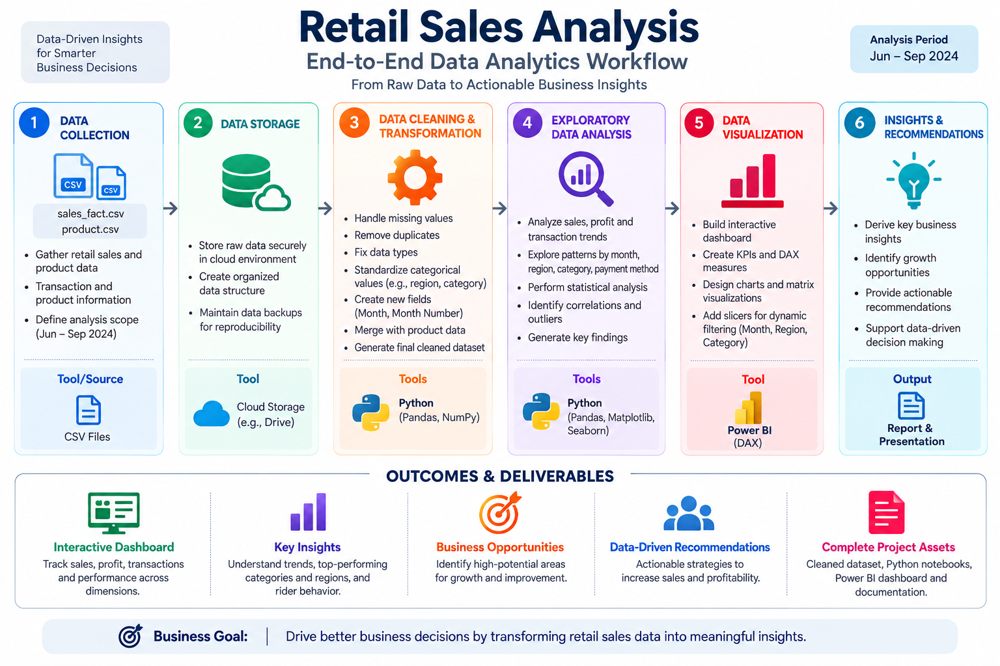
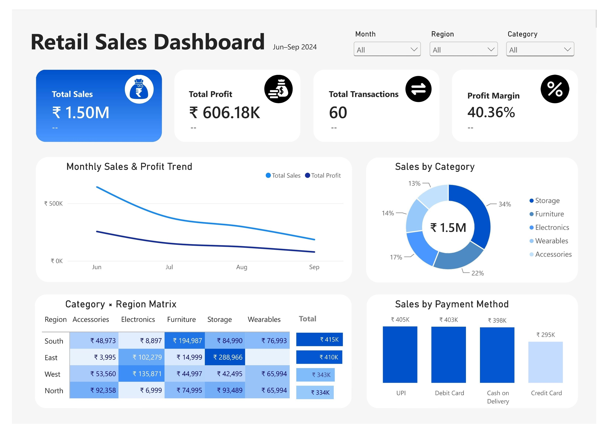

# 📊 Retail Sales Performance Analytics

**End-to-end analytics case study** — analyzing 60 cleaned retail transactions to diagnose a sharp Q3 revenue decline, identify the strongest regions and product categories, and translate the findings into actionable Q4 business recommendations using Python and Power BI.

</p>

<p align="center">


</p>

---

# 👨‍💻 Author

**Brojo Mohan Dutta**

**InternNova Data Analytics Internship**

**Week 6 Assignment: Git, GitHub & Final Data Analytics Project**

---

# 📌 Project Overview

This end-to-end data analytics project analyzes retail sales transactions from **June 2024 to September 2024** to understand a sharp decline in revenue and identify the key factors that should influence Q4 business decisions.

Using **Python, Pandas, NumPy, Matplotlib, Seaborn, Power BI, DAX, and Git/GitHub**, the project transforms raw transactional data into reliable analytical data, explores sales patterns and relationships, and communicates the findings through an interactive business dashboard.

The project follows the **Ask → Prepare → Process → Analyze → Share → Act** framework, taking the analysis from raw CSV files through data cleaning and EDA to Power BI reporting and business recommendations.

---

# 🎯 Business Problem

The retail business experienced a significant slowdown in revenue throughout Q3 2024.

The primary business question is:

> **Why is retail revenue declining from June to September 2024, where is the revenue coming from, and what actions should the business take to stabilize performance in Q4?**

The analysis focuses on:

- Monthly revenue trends
- Regional performance
- Product category performance
- Payment method performance
- Transaction-level outliers
- Price versus quantity as revenue drivers
- Actionable Q4 business opportunities

---

# 📊 Project Summary

| Category | Details |
|-----------|---------|
| Project | Retail Sales Performance Analytics |
| Author | Brojo Mohan Dutta |
| Course | Google Data Analytics Professional Certificate |
| Case Study | Capstone Project 2 |
| Dataset | Retail Transactional Sales Dataset |
| Raw Transactions | **61** |
| Clean Transactions | **60** |
| Time Period | **June–September 2024** |
| Product Categories | **5** |
| Regions | **4** |
| Payment Methods | **4** |
| Total Sales | **₹1.50M** |
| Total Profit | **₹606.18K** |
| Profit Margin | **40.36%** |
| Tools | Python, Pandas, NumPy, Matplotlib, Seaborn, Power BI, DAX, Jupyter, Git/GitHub |
| Dashboard | Interactive Power BI Dashboard |
| Project Type | End-to-End Data Analytics |

---

# 🛠 Technology Stack

| Tool | Purpose |
|------|---------|
| Python | Data preparation, transformation and analytical workflow |
| Pandas | Data cleaning, manipulation and aggregation |
| NumPy | Numerical analysis and data processing |
| Matplotlib | Exploratory data visualization |
| Seaborn | Statistical visualization and correlation analysis |
| Jupyter Notebook | Interactive Python analysis and documentation |
| Power BI | Interactive dashboard and business reporting |
| DAX | KPI and Month-over-Month calculations |
| Git | Version control |
| GitHub | Repository management and project documentation |

---

# 🔄 Project Workflow

<p align="center">

</p>

The project followed this analytical workflow:

1. Load raw retail transaction and product datasets
2. Inspect data structure, data types, missing values and duplicates
3. Clean and standardize the transactional data using Python
4. Merge transaction data with the product dimension
5. Calculate sales, cost and profit metrics
6. Perform exploratory data analysis using Python
7. Identify trends, correlations and transaction-level outliers
8. Build an interactive Power BI dashboard
9. Validate Power BI results against Python outputs
10. Translate findings into business recommendations

---

# 📂 Dataset Overview

The project uses two primary source datasets:

### `sales_fact.csv`

Raw transaction-level sales records containing:

- Sale ID
- Order Date
- Product ID
- Region
- Payment Method
- Quantity
- Unit Price
- Sales Amount
- Notes

### `products.csv`

Product dimension table containing:

- Product ID
- Product Name
- Category
- Unit Cost

The two datasets were combined during the data preparation stage to create the final analysis-ready dataset.

The raw dataset contained **61 transactions**, while the final cleaned dataset contained **60 transactions across 13 columns**.

---

# 📈 Exploratory Data Analysis

The EDA phase was performed using **Pandas, NumPy, Matplotlib and Seaborn**.

Analysis includes:

- Descriptive Statistics
- Monthly Sales Analysis
- Regional Sales Analysis
- Category Sales Analysis
- Payment Method Analysis
- Correlation Analysis
- Sales Distribution Analysis
- IQR-Based Outlier Detection
- Unit Price vs Sales Analysis
- Category-Level Sales Distribution
- Transaction Count Analysis
- Correlation Heatmap

---

# 📊 Dashboard Preview

## Retail Sales Dashboard



The Power BI dashboard provides an executive view of:

- Total Sales
- Total Profit
- Total Transactions
- Profit Margin
- Monthly Sales & Profit Trend
- Sales by Category
- Category × Region Matrix
- Sales by Payment Method

Interactive slicers are available for:

- Month
- Region
- Category

---

# 📈 Key Findings

- Revenue declined consistently every month, falling from **₹643,016 in June to ₹184,544 in September**, representing an approximately **71% peak-to-trough decline**.
- **South and East** were the strongest regions, generating approximately **₹825K or 55% of total sales** combined.
- **Storage** was the top-performing category, contributing approximately **34% of total revenue (₹509,940)**.
- **Credit Card** sales were significantly lower at **₹295,451**, compared with approximately ₹398K–₹405K across UPI, Debit Card and Cash on Delivery.
- **Unit Price** had a stronger correlation with Sales Amount (**0.656**) than Quantity (**0.474**), suggesting that pricing and product mix were more influential revenue drivers than order size in this dataset.
- Sales Amount and Profit showed an almost perfect correlation of **0.998**, reflecting the strong relationship between revenue and profitability.
- Two high-value **Gaming Chair** transactions exceeded the IQR upper bound, but were retained because they represented legitimate bulk orders rather than data errors.
- The final dataset contained **0 missing values and 0 duplicates**, providing a validated foundation for EDA and Power BI reporting.

---

# 💡 Business Recommendations

### 🥇 Recover the Revenue Trend

Launch a targeted Q4 retention and revenue-recovery initiative.

First determine whether the decline is primarily driven by transaction volume, average order value, inventory availability, marketing activity, or seasonality before allocating significant campaign budget.

---

### 🥈 Double Down on Proven Strength

Prioritize **Storage products in the South and East regions** for inventory availability, targeted promotions and marketing investment.

This focuses resources on the strongest existing revenue combination rather than distributing resources evenly across all regions and categories.

---

### 🥉 Fix the Credit Card Gap

Investigate the significant performance gap in Credit Card transactions.

Audit potential issues involving:

- Payment failures
- Authorization problems
- Checkout friction
- Processing issues
- Customer payment preferences

A targeted improvement could help recover additional revenue if the gap is caused by payment or checkout friction.

---

# 📂 Repository Structure

```text
Retail-Sales-Analysis/

│── README.md
│── LICENSE

├── 01_datasets
│   ├── products.csv
│   ├── sales_data_cleaned.csv
│   └── sales_fact.csv
│
├── 02_python_cleaning
│   ├── Dataset_Selection&Data_Preparation.ipynb
│   └── Dataset_Selection&Data_Preparation.py
│
├── 03_python_eda&visualization
│   ├── eda_visualizations
│   ├── EDA&Visualizations.ipynb
│   └── Exploratory_Data_Analysis_&_Visualizations.py
│
├── 04_power_bi
│   ├── Retail Sales Performance Dashboard.pbix
│   └── Retail_Sales_Dashboard.jpg
│
├── 05_documentation
│   ├── Retail_Sales_Performance_Analytics_Presentation.pptx
│   ├── Retail_Sales_Performance_Analytics_Presentation.pdf
│   ├── Retail_Sales_Performance_Analysis_Report.docx
│   ├── Retail_Sales_Performance_Analysis_Report.pdf
│   └── Workflow.png
